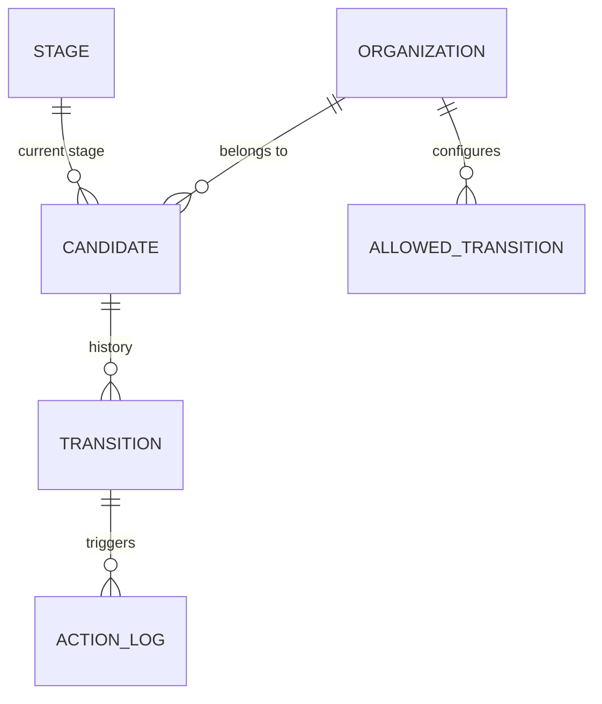

# Multi-tenant Applicant Pipeline

A production-ready multi-tenant applicant pipeline where organizations manage candidates moving through configurable stages. The system enforces valid transitions per organization and handles automated side effects (webhooks/emails) asynchronously.

## Quick Start

```bash
docker-compose up
```

That's it. Open **http://localhost:3000** in your browser.

The single command will:
1. Start PostgreSQL with a healthcheck
2. Run database schema push and seed two organizations with candidates
3. Start the backend API on **port 3001**
4. Build and serve the frontend via nginx on **port 3000**

---

## Architecture

```
backend/              Node.js + Express + TypeScript (Clean Architecture Lite)
  domain/             Pure types — zero dependencies
  application/        Use cases orchestrating domain logic
  infrastructure/     Express routes, EventEmitter, Prisma client

frontend/             React + Vite + TypeScript + Tailwind CSS
```

### Tech Stack

| Layer       | Technology                             |
|-------------|----------------------------------------|
| Backend     | Node.js, Express, TypeScript           |
| Database    | PostgreSQL, Prisma ORM                 |
| Validation  | Zod                                    |
| Frontend    | React 18, Vite, Tailwind CSS, Lucide   |
| Container   | Docker Compose                         |

---

## Data Schema



---

## API Endpoints

| Method  | Path                          | Description                            |
|---------|-------------------------------|----------------------------------------|
| GET     | `/organizations`              | List all organizations                 |
| GET     | `/organizations/:id/board`    | Kanban board with stages & candidates  |
| PATCH   | `/candidates/:id/move`        | Move a candidate to a new stage        |

**PATCH `/candidates/:id/move`** body:
```json
{
  "targetStageId": "uuid",
  "note": "optional note"
}
```

---

## Seed Data

Two organizations are pre-seeded with different transition rules:

**TechCorp** — standard flow:
- NEW → REVIEWING
- REVIEWING → ACCEPTED
- REVIEWING → REJECTED
- NEW → REJECTED (fast-track rejection)

**StartupHub** — extended flow:
- NEW → REVIEWING
- REVIEWING → ACCEPTED
- REVIEWING → REJECTED
- REVIEWING → NEW *(can send back for more info)*
- ACCEPTED → REJECTED *(late rejection after offer)*

---

## Event-Driven Side Effects

When a candidate is moved, a `candidate.moved` event is emitted and processed asynchronously:

| Transition             | Action                                          |
|------------------------|-------------------------------------------------|
| NEW → REVIEWING        | Logs "Welcome Questionnaire Sent" to ActionLog  |
| REVIEWING → ACCEPTED   | Fires HTTP POST to `WEBHOOK_URL` (3 retries with exponential backoff) |

All actions are tracked in the `ActionLog` table with `PENDING / SUCCESS / FAILED` status and `attemptCount`.

---

## Configuration

Please visit this [webhook.site](https://webhook.site/#!/view/318dfc8d-cebf-4376-b49c-a38021c5d86e) URL to observe acceptance webhook payloads in real time for this demonstration.

---

## Local Development (without Docker)

```bash
# Start postgres
docker-compose up postgres -d

# Backend
cd backend
npm install
npx prisma generate
npx prisma db push
npx ts-node prisma/seed.ts
npm run dev

# Frontend (new terminal)
cd frontend
npm install
npm run dev
```
